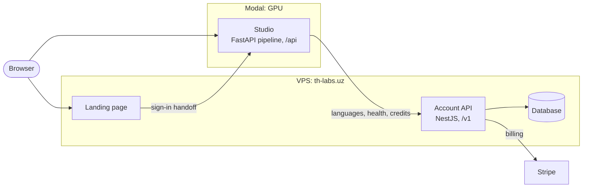
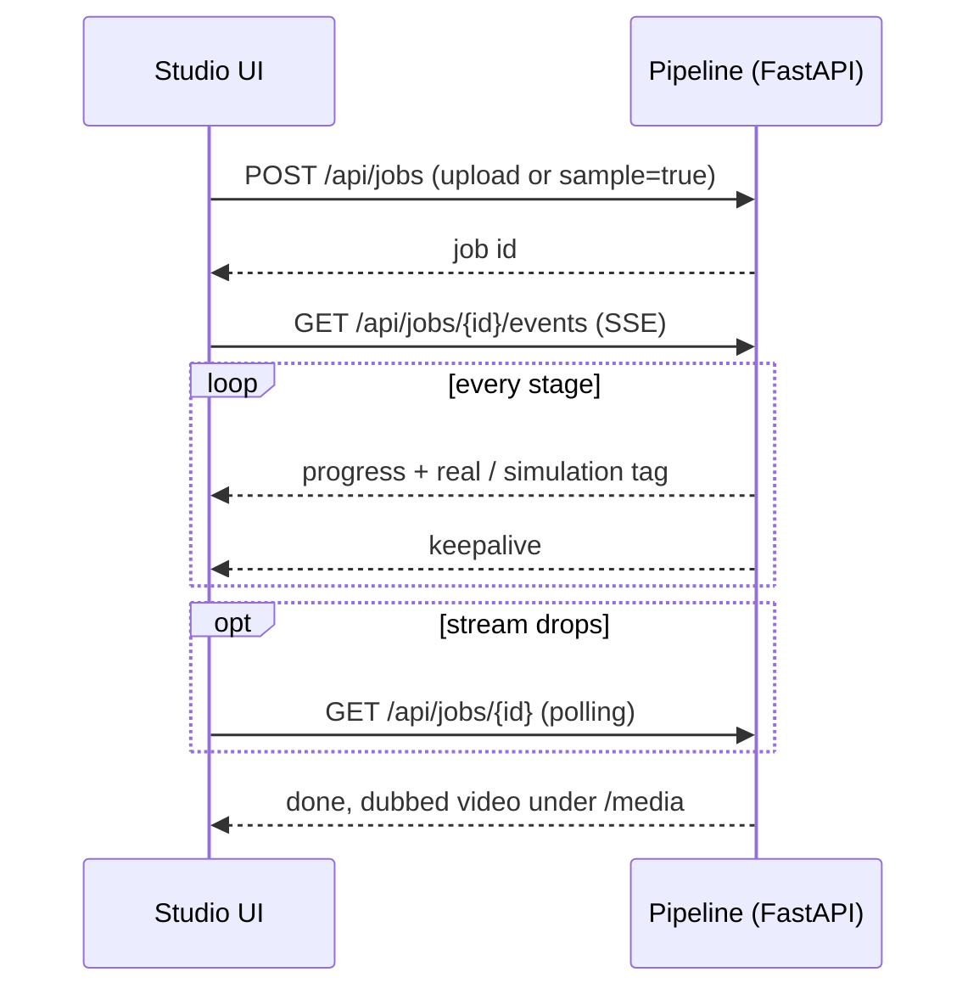

<div align="center">

<a href="https://th-labs.uz">
  
</a>

<br />

**Translate any video into 32 languages while keeping the speaker's own voice.**

[](https://th-labs.uz)
[](https://th-labs.uz/docs)


[How it works](#how-it-works) &nbsp;&nbsp; [Quick start](#quick-start) &nbsp;&nbsp; [Real models](#enabling-real-models) &nbsp;&nbsp; [API](#api) &nbsp;&nbsp; [Evaluation](#evaluation) &nbsp;&nbsp; [Architecture](docs/ARCHITECTURE.md)

</div>

---

## What it is

TH-LABS turns a source video into a dubbed video in another language **without replacing the speaker's voice**. This repository is the full-stack implementation of the four-stage cascade (ASR → NMT → TTS-VC → Sync) from the RSEF 2026 paper:

> *An Automatic AI Dubbing System for Multilingual Video Translation with Voice Preservation*
> Isoqov Jo'rabek & Asilbek Abdug'afforov, New Uzbekistan University

It ships three things: an interactive **landing page**, a live dubbing **Studio**, and a **Research** page, all backed by a modular FastAPI pipeline.

## How it works

<div align="center">
  
</div>

The source audio splits into two lanes. The **speech lane** is transcribed, translated and re-voiced in the original speaker's timbre. The **background lane** keeps the music and effects. They meet again at the mix, so the video is *dubbed*, not replaced, and the original language is inaudible.

| Stage | Engine | What it does |
| --- | --- | --- |
| **VAD** | silero-vad | Finds real speech so ASR ignores music and silence |
| **ASR** | Whisper medium (openai-whisper) | Transcribes only the speech, with timestamps |
| **NMT** | NLLB-200 (distilled-600M) | Transformer translation, length-scored to fit the original timing |
| **TTS** | edge-tts | Speaks the translation in a natural per-language neural voice, Uzbek included |
| **Voice clone** | OpenVoice v2 locally, OmniVoice in the cloud | Transfers the source speaker's timbre onto the TTS voice and reports the measured speaker similarity. OpenVoice is 131 MB and runs on a 6 GB GPU |
| **Background** | Demucs | Removes the original speech, keeps music and FX |
| **Lip sync** *(optional)* | Wav2Lip | Reshapes the speaker's mouth to the new speech |
| **Sync & mux** | ffmpeg | Time-aligns the audio to the video and muxes the output |

> [!NOTE]
> **Why NLLB-200?** The paper specifies a Transformer-based NMT. NLLB-200 is exactly that, is openly available, covers 200 languages, and the distilled-600M variant fits a 6 GB GPU. It's set in one place (`TH_LABS_NMT_MODEL`), so you can swap in OPUS-MT / MarianMT for a lighter model.

### Real inference vs. simulation

Every stage adapter has a **real** implementation and a **labelled simulation** fallback. Heavy imports are lazy, so the server always starts, and each stage reports `real` or `simulation` at `/api/health`. The UI never fakes silently: a `live inference` / `simulation` badge and per-stage tags show exactly what ran.

The default is `TH_LABS_MODE=auto`: real models where installed, simulation otherwise.

| Path | Behaviour in `auto` mode |
| --- | --- |
| **Built-in sample** | A short English lecture clip that runs real Whisper + NLLB end to end, so you get a genuine EN → UZ (or any target) demo without uploading anything |
| **Your upload** | Real Whisper + NLLB, falling back to simulation per stage only if a model errors. No detectable speech means the ASR stage says **"No speech detected"** instead of inventing a transcript |
| **TTS** | edge-tts speaks the translation; voice cloning then applies the source speaker's timbre when its model loads. Fallback chain: clone → edge-tts → tone |
| **Background** | Demucs separation, on by default (*Keep background music & effects*). Runs on CPU unless `TH_LABS_SEPARATION_DEVICE=cuda` |
| **Lip sync** | Simulation until a Wav2Lip checkout is configured |

`TH_LABS_MODE=demo` forces all-simulation and never imports heavy libraries.

<details>
<summary><b>Why VAD runs first</b></summary>
<br />

Whisper hallucinates text on non-speech audio. Music, silence and intros turn into phantom lines like *"Thanks for watching!"*. silero-vad isolates real speech regions first; Whisper only transcribes those, and any segment that doesn't overlap speech (or that Whisper flags as non-speech) is dropped. If VAD finds no speech, the job says so.

Jobs also run **one at a time**: the shared Whisper model isn't thread-safe, and a 6 GB GPU can't hold two runs at once.
</details>

<details>
<summary><b>Long videos</b></summary>
<br />

Real inference runs at roughly 0.3–0.6× real-time, so a 15-minute clip takes several minutes. ASR and NMT emit a progress heartbeat, the SSE stream sends keepalives, and the frontend falls back to polling if the stream drops, so long jobs show steady progress instead of looking frozen.
</details>

<details>
<summary><b>Python 3.14</b></summary>
<br />

The HuggingFace `tokenizers` Rust extension segfaults on 3.14, which breaks faster-whisper and NLLB's *fast* tokenizer. The app sidesteps it: **STT uses openai-whisper** (torch + tiktoken) and **NMT uses the slow SentencePiece tokenizer**, so real STT + NMT run on 3.14. OmniVoice still wants Python 3.11 / 3.12.

Models warm in the background on the first request (about 30 s, once). After that, a 30 s clip dubs in about 15–20 s.
</details>

---

## Quick start

**You need** Node 18+, Python 3.11–3.13 (3.14 runs the API, but ML wheels may be missing) and `ffmpeg` on your PATH.

```bash
# 1. Backend  →  http://localhost:8000
cd backend
python -m pip install -r requirements.txt   # core API only, lightweight
python run.py
```

```bash
# 2. Frontend  →  http://localhost:5173
cd frontend
npm install
npm run dev
```

Open **http://localhost:5173**. Vite proxies `/api` and `/media` to the backend, so there's no CORS setup.

> [!TIP]
> Start with the built-in sample clip. Once Whisper and NLLB are installed, it gives you a real end-to-end dub with no upload.

## Enabling real models

Everything is opt-in through `backend/.env` (see `.env.example`).

```bash
# STT: Whisper medium (torch + tiktoken, 3.14-safe)
pip install openai-whisper

# NMT: NLLB-200 (downloads ~2.4 GB on first run)
pip install "transformers>=4.40" torch sentencepiece

# Voice cloning: OmniVoice zero-shot
pip install omnivoice soundfile   # needs transformers with HiggsAudioV2TokenizerModel
TH_LABS_OMNIVOICE_MODEL=k2-fsa/OmniVoice

# Lip sync: Wav2Lip (with checkpoints/wav2lip_gan.pth)
TH_LABS_WAV2LIP_DIR=/path/to/Wav2Lip

# auto (default) | demo (all simulation) | real (require models)
TH_LABS_MODE=auto
```

The OmniVoice and Wav2Lip wiring lives in `app/pipeline/tts.py` and `app/pipeline/lipsync.py` as thin, documented integration functions.

---

## Architecture

```text
frontend/                  React + Vite + TypeScript + Tailwind v4 + Framer Motion
  src/
    pages/                 Landing, Studio, Research
    components/            PipelineDiagram, MetricsShowcase, Uploader, LanguageSelect,
                           StageTimeline, VideoCompare, SegmentTable, ...
    lib/                   api.ts (fetch + SSE), types.ts

backend/                   FastAPI, modular pipeline
  app/
    main.py                REST + SSE endpoints, /media static serving
    jobs.py                in-memory job store, async runner, SSE broadcast
    schemas.py             Pydantic models
    languages.py           32 languages (Whisper + NLLB codes)
    pipeline/
      orchestrator.py      runs each stage, emits live progress
      stt.py nmt.py tts.py lipsync.py sync.py     one adapter per stage
      metrics.py media.py samples.py
```

The product runs as two halves: the site and account API on a VPS, and the GPU Studio on Modal.



For the sign-in handoff, credits and Stripe, and what breaks when the two halves drift apart, read **[docs/ARCHITECTURE.md](docs/ARCHITECTURE.md)**.

## API

**Account API** — NestJS at `https://th-labs.uz`. Up whenever the site is.

| Method | Endpoint | Purpose |
| --- | --- | --- |
| `GET` | `/v1/health` | API and database status, plus the pipeline's per-stage engines (probed server-side) |
| `GET` | `/v1/languages` | All 32 supported languages |
| `GET` | `/v1/languages/{code}` | One language |
| `GET` | `/docs` | Swagger UI. This is a page, not the API base; routes live under `/v1` |

**Dubbing pipeline** — FastAPI on the GPU box. Often asleep; only dubbing depends on it.

| Method | Endpoint | Purpose |
| --- | --- | --- |
| `POST` | `/api/jobs` | Create a job (multipart upload or `sample=true`) |
| `GET` | `/api/jobs/{id}` | Job snapshot |
| `GET` | `/api/jobs/{id}/events` | Live progress over SSE |
| `GET` | `/media/...` | Source and dubbed media |
| `GET` | `/api/health`, `/api/languages` | Still served, but the UI reads the account API's copies |

> [!IMPORTANT]
> The UI reads languages and health from the account API on purpose. When they came from the GPU box, a sleeping box took the language picker and status strip down with it.

<details>
<summary><b>Lifecycle of a dubbing job</b></summary>
<br />


</details>

---

## Evaluation

<div align="center">
  
</div>

Results from the RSEF 2026 study. The 41 ms sync offset sits inside the ITU-R BT.1359-1 imperceptibility threshold.

## Ethics

Voice cloning here is meant to re-voice a speaker's **own** words for their **own** video. Any third-party use needs explicit consent from the speaker and a clear *AI-dubbed* label.

## Citation

If you use this work, please cite the paper:

```text
Isoqov, J. & Abdug'afforov, A. (2026). An Automatic AI Dubbing System for Multilingual
Video Translation with Voice Preservation. RSEF 2026, New Uzbekistan University.
```

---

<div align="center">
<sub>Built for research and authorized use &nbsp;&nbsp; New Uzbekistan University &nbsp;&nbsp; RSEF 2026 &nbsp;&nbsp; <a href="https://th-labs.uz">th-labs.uz</a></sub>
</div>
