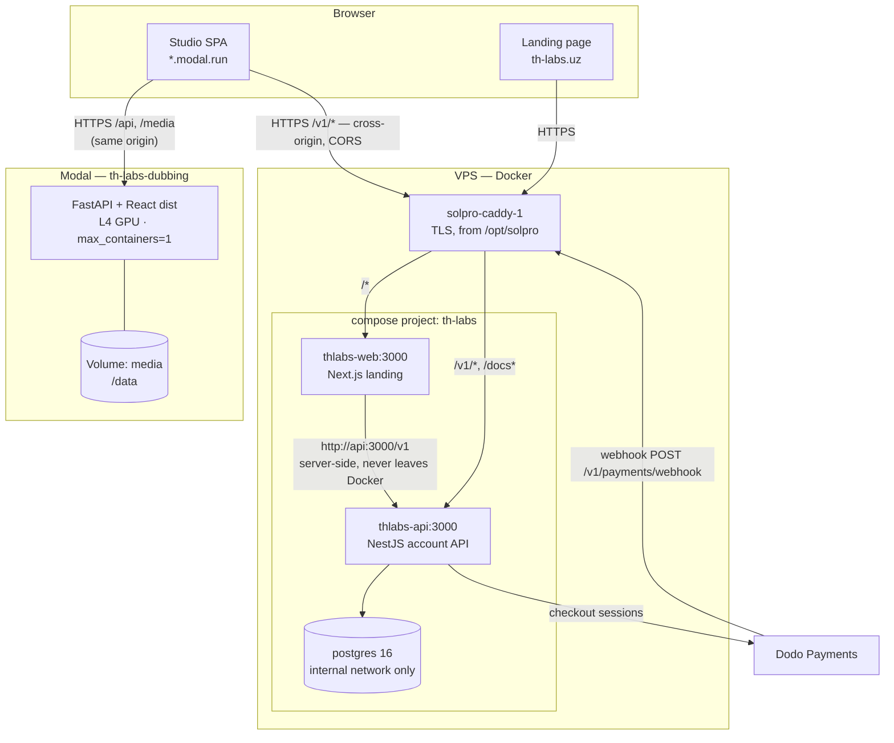
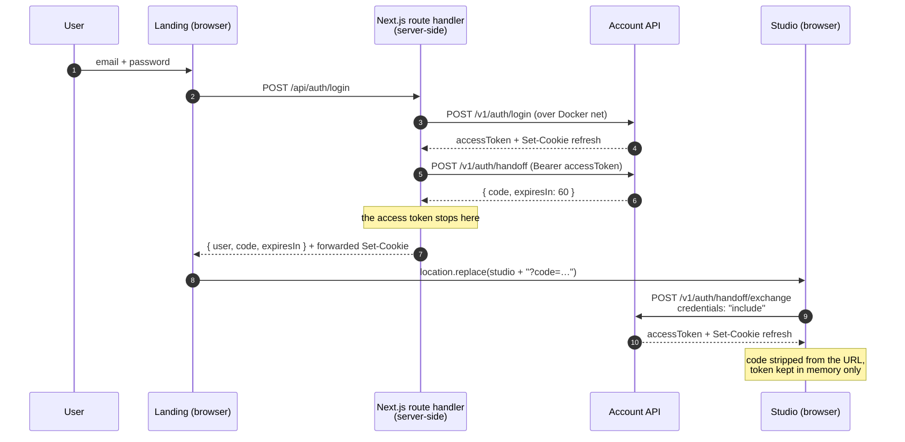
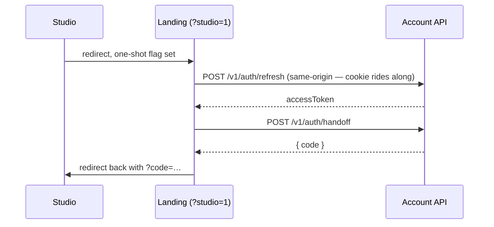
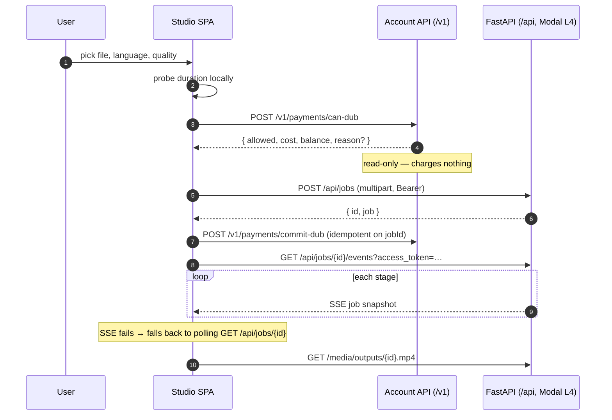
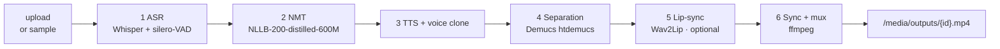
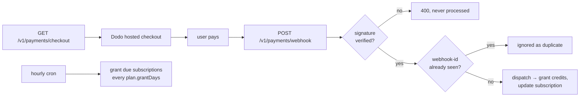
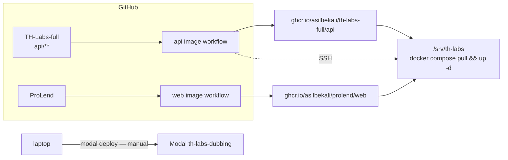

# TH-Labs — how the whole thing works

Two products, two repos, two hosts, one account system.

* **The landing page** (`ProLend` repo, Next.js) — the doorway. Marketing, the
  community signup form (`POST /v1/community` — the table formerly called
  `Waitlist`), sign-up, sign-in. Runs in Docker on the VPS behind Caddy at `th-labs.uz` /
  `aytingchi.uz`.
* **The account API** (`api/`, NestJS + PostgreSQL) — the only thing that owns
  users, sessions, credits and money. Same VPS, same Caddy, published at `/v1`.
* **The Studio** (`frontend/` + `backend/`, React + FastAPI) — the actual product.
  Runs on **Modal**, on an L4 GPU, at
  `https://isoqovjorabek2--th-labs-dubbing-web.modal.run`.

The Studio has **no user database and no login of its own**. It verifies tokens the
account API mints. That single fact is what shapes most of the design below.

---

## 1. The map



**Routing rules** (`deploy/server/aytingchi.caddy`, longest match wins):

| Path | Goes to |
|---|---|
| `/v1/*` | `thlabs-api:3000` — the account API |
| `/docs*` | the same API's Swagger UI |
| `/*` | `thlabs-web:3000` — the landing page |

Nothing in the `th-labs` compose project publishes a host port. The stack joins
solpro's external network `solpro_default` under `thlabs-` aliases, and the only
way in is through Caddy. The database is on a private `internal` network and is
unreachable even from solpro's own containers.

`/v1` being public is **load-bearing, not incidental**: the Studio is a different
origin with no session of its own, so it calls this API **from the browser** to
redeem its handoff code and to refresh afterwards. Remove that handle and a user
who signs in on the landing page arrives at a Studio that cannot log them in.

---

## 2. Sign-in: how a session crosses origins

The landing page and the Studio are different origins, so a cookie set on
`th-labs.uz` cannot be read on `*.modal.run`. The session has to travel in the
redirect. What travels is a **one-time code**, never a token.



Why it is shaped this way:

* **The code is the only thing the browser ever sees.** 32 CSPRNG bytes,
  base64url, 60-second TTL, exactly one redemption. Only its SHA-256 is stored.
  The copy that lands in browser history and in Modal's ingress log is already
  dead by the time anyone could read it.
* **Single-use is enforced by the database, not by an `if`.** Redemption is one
  `updateMany` with `usedAt: null` and `expiresAt > now` inside the `WHERE`, so
  two simultaneous requests cannot both pass.
* **Every failure returns the same message.** Unknown, expired and already-spent
  are indistinguishable, so the endpoint cannot be used to probe which codes existed.
* **This replaced tokens-in-the-query-string.** The old version put a 7-day
  self-renewing refresh token in the address bar. That is gone, and with it the
  `localStorage` copy — no token is exposed to client-side JS on the landing origin.

Access tokens are HS256, 15 minutes, held **in memory only**. The refresh token is
an opaque httpOnly cookie scoped to `/v1/auth`, `SameSite=None; Secure` in production.

### Silent resume, when the third-party cookie is blocked

From `*.modal.run`, the account API's cookie is third-party — Safari blocks those
outright, Chrome is winding them down. So the Studio can be unable to refresh even
though the user is perfectly signed in.



The landing origin *is* first-party to that cookie, so it can still see the
session. If the refresh fails the user really is signed out: `?studio=1` is
stripped and the normal page renders, and the Studio's one-shot flag stops a
ping-pong loop.

---

## 3. A dub, end to end



Two details worth knowing:

* **The gate and the charge are separate calls.** `can-dub` is a read-only
  preflight; `commit-dub` runs only once the job exists, is idempotent on
  `jobId`, and is fire-and-forget so it never blocks the pipeline UI.
* **The SSE stream takes the token in the query string.** `EventSource` cannot
  send an `Authorization` header — the browser API takes a URL and nothing else.
  This is the one place a token legitimately appears in a URL: it is the
  short-lived access token, never the refresh token, and the request is
  same-origin. Everything else uses the header.

Every route under `/api/jobs` requires a bearer token (`backend/app/auth.py`)
and is scoped to its owner. Someone else's job returns **404, not 403** — job ids
are random, so "this exists but is not yours" is information the caller has no
way to obtain and no reason to receive.

---

## 4. The pipeline

`backend/app/pipeline/orchestrator.py`. Each stage runs its real engine when
available and a simulation fallback otherwise, so the orchestrator behaves
identically either way — only the `simulated` flag differs.



| Stage | What it does | Notes |
|---|---|---|
| **ASR** | Whisper, VAD-gated | model by quality: `fast`→base, `balanced`→small, `studio`→medium |
| **NMT** | NLLB-200 distilled 600M | length-compatibility scoring; falls back to simulation on error |
| **TTS** | OmniVoice → edge-tts → tone | first engine that produces audio wins |
| **Separation** | Demucs, keeps music/FX, drops source speech | **skipped in `fast`** |
| **Lip-sync** | Wav2Lip | opt-in per job |
| **Sync** | mix dubbed voice over background, mux | `voice_gain` / `background_gain` |

The TTS chain is the subtle one:

1. **OmniVoice** clones the source speaker directly. Needs `transformers>=5.3` —
   which is the entire reason the Studio runs in the cloud rather than on the dev box.
2. Otherwise **edge-tts** gives a real neural voice per language, and then
   **OpenVoice** clones the source speaker's timbre onto it. Skipped in `fast`
   mode, where CPU cloning is too slow.
3. Otherwise a placeholder tone.

**Real ASR never fabricates a transcript.** If VAD-gated Whisper finds no speech,
the job says so — it does not silently fall back to the canned demo scenario.

Every stage emits a progress snapshot over SSE, with a heartbeat that nudges the
bar every ~4s so a 15-minute transcription stays visibly alive and the stream
doesn't idle out.

---

## 5. Money

Credits are the unit. `User.credits` is a **cached balance**; the `CreditEntry`
ledger is the truth, and `/v1/payments/credits/reconcile` reports drift.

| Quality | Cost | | |
|---|---|---|---|
| fast | 5 | Free dub | one per user, source ≤ **120 s** |
| balanced | 10 | Signup grant | 60 credits |
| studio | 20 | Authority | `api/src/payment/quality-cost.ts` |

The frontend's `QUALITY_COST` is a **display hint only** — the server table is
what `can-dub` and `commit-dub` enforce.



**Payments live entirely on the account API.** Neither `backend/` nor
`deploy/modal/` contains a single Dodo reference — the Studio only calls
`/v1/payments/*` and follows the URL it is handed. Configuring Dodo on Modal
does nothing.

* **Missing payment config fails quiet.** The API boots without it and still
  serves `/payments/plans`, so the Plans page looks healthy. But
  `DODO_WEBHOOK_SECRET` absent means `constructEvent` throws before any
  dispatch — and webhooks are the only thing that grants credits, so a user pays
  and receives nothing. `DODO_PRODUCT_*` absent means `seed.ts` writes
  `dodoProductId: null` and `/payments/checkout` 400s before the user even
  reaches Dodo. Both must be passed through `deploy/server/docker-compose.yml`
  to reach the container; see `deploy/server/README.md` § 6. The API reports
  both states on `/payments/plans` (`checkout`) so the UI can say so out loud
  rather than offering a button that fails.
* **Checkout metadata is how a payment finds its user.** `getCheckoutUrl` opens
  a Dodo checkout session stamped with `th_user_id` / `th_plan_id`; the webhook
  reads them back. On the static-link fallback that metadata is a query
  parameter the customer could edit, so the handler cross-checks it against the
  email that actually paid and credits the payer on a mismatch. An event with
  neither is logged and ignored.
* **Idempotency is a unique constraint**, not an `if` — `WebhookEvent.eventId`,
  the Standard Webhooks `webhook-id`. That is what makes Dodo's retries safe. If
  dispatch throws, the marker is deleted so the retry reprocesses it. A second
  layer guards the money itself: `Payment.dodoPaymentId` is unique and the grant
  rides in the same transaction.
* **Only `payment.succeeded` grants credits.** It is the one event that means
  money moved, and it fires for the first charge and every renewal alike. The
  `subscription.*` events only sync state, so an authorised mandate whose charge
  later fails cannot hand out a month of credits.
* **The hourly cron is what makes yearly plans drip.** Dodo bills once; credits
  are handed out every `plan.grantDays`. Without it a user could buy a year, burn
  24 000 credits in a week, and cancel.

**Data model** (`api/prisma/schema.prisma`): `User`, `Admin`, `Community`,
`Feedback`, `Plan`, `CreditPack`, `Subscription`, `Payment`, `CreditEntry`,
`RefreshToken`, `HandoffCode`, `Language`, `AuditLog`, `WebhookEvent`.

`Community` is the old `Waitlist` table, renamed in place — the rows came along
(`20260913120000_community_and_email_templates`). The route was renamed with it,
so the landing page's signup form posts to **`POST /v1/community`**, and
`/v1/wait-list` no longer exists. Note that **there has never been a
`/api/waitlist`**: `/api` is the FastAPI dubbing pipeline, which serves jobs and
media only, so any call there 404s regardless of the path.

`Feedback` is its sibling and is deliberately a different table: `Community` is a
contact list to email, `Feedback` is an inbox of messages to read and answer. See
§5.1.

### 5.1 Feedback — how a message gets from the app to staff

The one place the product asks the user for something rather than showing them
something. Three hops, no queue and no third-party form:

```
Home page (frontend/src/components/FeedbackSection.tsx)
  → POST /v1/feedback                (api/src/feedback/*)
      ├── row in `Feedback`, status NEW
      ├── receipt email to the sender (MailService.sendFeedbackReceipt)
      └── row in `AuditLog`, action `feedback.create`
  → admin panel inbox                (GET /v1/feedback, see ADMIN_PANEL_BRIEF §4.6)
```

**How to use it, as a user.** Open the app's Home page and scroll to *Feedback*
(the last section). Pick what kind of message it is — General, Something broke,
Dub quality, Feature idea, or Pricing — write at least a sentence, and send. A
star rating is offered and is optional. You do not need to be signed in; if you
are, the message is stamped with your account so staff can see your dubs and
credits while reading it. Either way a short confirmation email goes to the
address you gave, and replying to that email reaches the same people.

**How to use it, as staff.** The panel's Feedback screen lists newest first and
defaults to unread. `newCount` on the list response is the unread total across
the whole table, for the nav badge. Triage moves `status`
(`NEW → READ → IN_PROGRESS → RESOLVED`, or `SPAM`) and can attach a private
`adminNote`. **The message body is not editable** — `PATCH` accepts only those
two fields and 400s on anything else, so the record of what somebody actually
said cannot be rewritten. Delete is SUPERADMIN-only and is for spam, not for
tidying up a handled message.

**Two deliberate design choices.** `Feedback.userId` is nullable with
`ON DELETE SET NULL`, and `name`/`email` are copied onto the row at write time:
deleting an account must not delete what that person told us, and the message has
to stay attributable afterwards — the same reasoning as `AuditLog`'s
denormalised actor. And the rating is optional, so **no average rating is
computed anywhere**: it would be an average over a self-selected subset.

### 5.2 Dubbing from a link

`POST /api/jobs` takes three mutually exclusive sources: an uploaded `file`, a
`source_url`, or `sample=1`. Sending both a file and a URL is a 400 — silently
picking one is how somebody dubs the wrong video.

A `source_url` is fetched server-side by `backend/app/pipeline/fetch.py` before
the pipeline starts; from there on a link job is indistinguishable from an
upload. That module is where the rules live, and they are not optional
hardening — the endpoint fetches a URL chosen by the caller, which is SSRF by
construction:

* http/https only;
* the resolved address must be public — loopback, private, link-local
  (`169.254.169.254`, the cloud metadata endpoint) and reserved ranges are all
  refused, checked against **every** address the name resolves to;
* redirects are followed by hand so each hop is re-vetted (a public host that
  302s to `127.0.0.1` is the standard bypass);
* capped at 2 GB and 2 hours, so one paste cannot fill the disk or book hours of
  GPU time.

`yt-dlp` (in `backend/requirements.txt`) is what resolves a YouTube/Vimeo/TikTok
watch page to a media stream. Without it, link jobs still work for a **direct**
media URL and refuse a watch page with a message saying to install it. Keep it
current: extractors break when a site changes its player, and a stale yt-dlp is
the usual cause of "we couldn't download that video".

One honest caveat: the browser cannot probe a link's duration, so the pre-flight
credit gate for a link job runs on an estimate. The server learns the real length
after fetching, and the charge settles against that — which means a long video
can pass the pre-flight check and still be refused once measured.

---

## 6. Deploy



* **The VPS is push-to-deploy.** A push to `main` touching `api/**` builds the
  image, pushes to GHCR, then SSHes in and rolls it out. The server needs no
  checkout, no toolchain, no Node — only `docker-compose.yml` and `.env`. Rollback
  is one line: `API_IMAGE=…:sha-<commit> docker compose up -d api`.
* **Modal is not.** The Studio ships with `modal deploy deploy/modal/modal_app.py`,
  run by hand. Model weights (~6 GB) are baked into the image at build time so
  cold starts don't re-download them; uploads and finished dubs live on a Volume
  at `/data` so they survive a scale-down.
* `NEXT_PUBLIC_*` and `VITE_*` are **build args, not runtime env** — both bundlers
  inline them, so changing one means rebuilding the image.

---

## 7. The seams — what breaks if these drift

These are the couplings that are invisible until they fail. Each has bitten already.

| Contract | Between | Symptom when it breaks |
|---|---|---|
| `JWT_SECRET` ≡ `TH_LABS_JWT_SECRET` | Account API ↔ FastAPI | every `/api/jobs` call 401s. Blank on the Modal side → 503, deliberately failing closed |
| `VITE_ACCOUNT_API` | `modal_app.py` ↔ `frontend/src/lib/http.ts` | **silent.** Unset, it resolves to the Studio's own `/v1`, which is the SPA catch-all; sign-in POSTs get 405 and the form just never logs you in. The name must match exactly — it was once `VITE_ACCOUNT_API_URL` and did precisely this |
| CORS allowlist names the Studio origin | Account API | handoff exchange fails cross-origin; user lands signed-out |
| `NEXT_PUBLIC_MAIN_APP_URL` | Landing → Studio | redirect goes nowhere real. Defaults to the live Modal URL rather than a placeholder |
| `QUALITY_COST` server ≡ client | `quality-cost.ts` ↔ `wallet.tsx` | UI quotes one price, server charges another |
| `max_containers=1` | Modal | the job store is an in-memory dict. A second container has its own empty store and returns "Job not found" mid-job. To scale out, move it to a `modal.Dict` first |
| `sub` claim is numeric | NestJS ↔ PyJWT | PyJWT ≥ 2.10 enforces RFC 7519's string `sub` and rejects every genuine token; `verify_sub` is off and the type normalised instead |
| Volume mounted outside the repo | Modal | mounting on `backend/data/` (which ships `.gitkeep`s) crash-loops the container — Modal refuses a non-empty mount path |

---

## 8. Local development

| Piece | Command | Port |
|---|---|---|
| Account API | `cd api && yarn start:dev` | 3001 |
| Studio backend | `cd backend && python run.py` | 8000 |
| Studio frontend | `cd frontend && npm run dev` | 5173 → proxies `/v1`, `/api`, `/media` |
| Landing | `cd ../ProLend && npm run dev` | 3000 |

In dev everything is same-site, so cookies are `SameSite=Lax` and `VITE_ACCOUNT_API`
can stay unset — the Vite proxy resolves `/v1`. Both of those stop being true in
production, which is why the seams above exist.

The Studio also serves its own built SPA from FastAPI when `frontend/dist` is
present, so the whole app is one port. That is what makes the single-container
Modal deploy (and the Colab notebook) work.
